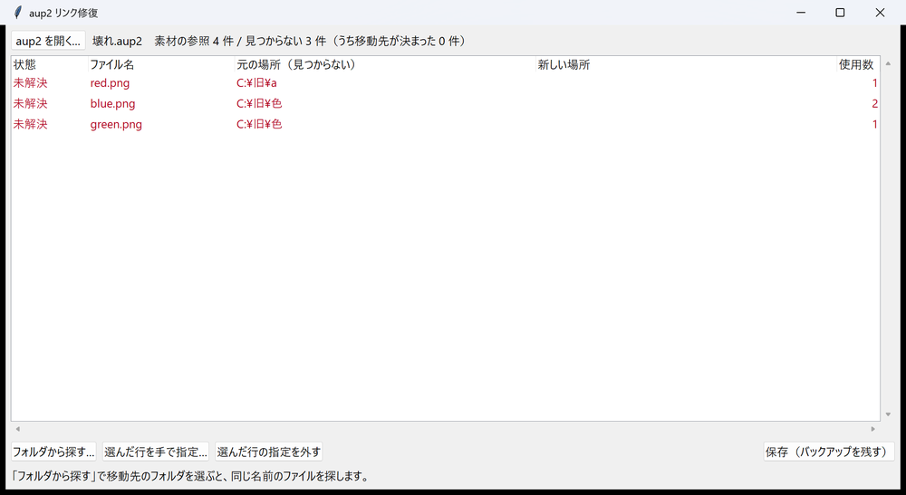

# aup2 リンク修復（aviutl2-aup2-relink）

AviUtl ExEdit2（AviUtl2）のプロジェクトファイル `.aup2` に書かれた素材（画像・動画・音声）のパスを、
移動先に書き換える Windows 用ツールです。素材のフォルダを整理して「ファイルが見つからない」状態に
なったプロジェクトを直せます。



## まず: 本体だけで直る場合

`.aup2` と素材を**フォルダごと**移動した場合（素材が `.aup2` と同じフォルダか、その下にある場合）は、
このツールは要りません。移動後の `.aup2` を AviUtl2 で開くと

> プロジェクトファイルのパスが変更されています。
> 以前のプロジェクトパスの配下の指定ファイルが存在しない場合は
> 現在のプロジェクトパスの配下に変更しますか？

と聞かれるので、OK を押して上書き保存します（AviUtl2 2.1.8 で確認）。

このツールが要るのは次の場合です。

- 素材だけを別の場所へ移した
- 素材が `.aup2` のフォルダの外にあった（別のフォルダに置いた画像を整理した、など）

## 似たツール

AviUtl2 カタログには [AviUtl2 relink（Book-0225）](https://github.com/Book-0225/aviutl2_relink) があります。
参照の一覧・存在チェック・パスの個別変更・フォルダ単位の一括置換・素材のコピーなどができ、
AviUtl2 の編集メニューから開けます。

このツールとの違いは次の 2 点です。

- 移動先のフォルダを指定すると、同じ名前のファイルを探して自動で埋める（素材がばらばらのフォルダへ散った場合に向く）
- 複数の `.aup2` をまとめて直せる

手で指定すれば足りる場合や、AviUtl2 の中から使いたい場合は、あちらが便利です。

## ダウンロード

[Releases](https://github.com/ar-ca-na/aviutl2-aup2-relink/releases) から zip を落とし、好きな場所に展開します。
インストールは不要です。

## 使い方

1. AviUtl2 でそのプロジェクトを閉じる。
   開いたまま AviUtl2 で上書き保存すると、ここで直した内容が消えます。
2. `aup2リンク修復.exe` を起動し、`.aup2` をウィンドウへドロップする。
   exe のアイコンへドロップしても開けます。フォルダをドロップすると中の `.aup2` を全部読みます。
3. 見つからない素材が一覧に出ます。
4. 「フォルダから探す…」で、移動先を含むフォルダを選ぶ。その中から同じ名前のファイルを探して埋めます。
   - 同じ名前が複数あると、元のフォルダ名に近いものを仮に選んで**橙色**で出します。確かめてください。
   - 見つからない行はダブルクリック（または「選んだ行を手で指定…」）でファイルを選びます。
     同じフォルダにあった他の素材も、移動先に同じ並びであれば自動で埋まります（「フォルダ推定」）。
   - 間違えた行は「選んだ行の指定を外す」で戻せます。
5. 「保存」。元のファイルは `名前.aup2.bak-日時` として同じ場所に残ります。
6. AviUtl2 で開きます。

## 仕様・注意

- 書き換えるのは素材パスの行だけです。他の行はバイト単位でそのまま残します（改行コード・BOM も保ちます）。
- `[project]` の `file=`（`.aup2` 自身の保存場所）は変えません。
- テキストオブジェクトの本文は対象外です。
- 探すのはファイル名が同じものだけです。名前を変えた素材は手で指定してください。
- 起動中の AviUtl2 のタイトルに同じファイル名があると、保存の前に警告します。
- 元に戻すには、`.bak-日時` のファイルの名前から `.bak-日時` を消して `.aup2` に戻します。

## ビルド

Python 3.13、[tkinterdnd2](https://pypi.org/project/tkinterdnd2/)、PyInstaller で作っています。

```
pip install tkinterdnd2 pyinstaller
build.bat
```

`dist\aup2relink.exe` ができます。Python があれば `python aup2relink.py` でもそのまま動きます。

## ライセンス

[MIT](https://github.com/ar-ca-na/aviutl2-aup2-relink/blob/main/LICENSE)
